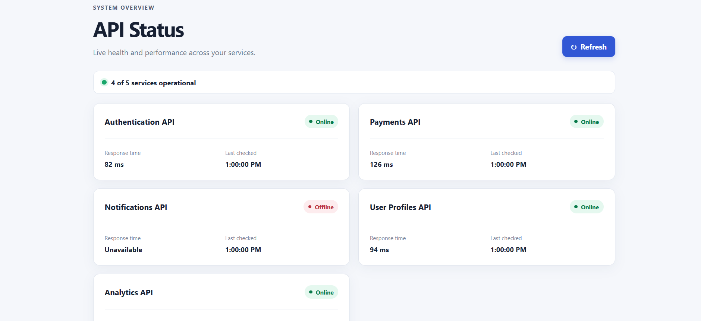

# API Status Dashboard

A clean, responsive single-page dashboard for viewing the availability and performance of API services. It presents five example services with their current status, response time, and last checked time in a simple, professional interface.

## Features

- Five example API services displayed as responsive cards
- Clear online and offline status indicators
- Response times in milliseconds for available services
- Last checked time for every service
- Operational service summary
- Refresh button that simulates updated response times and timestamps
- Responsive layout for desktop and mobile screens
- Basic component and refresh behavior tests

## Tech Stack

- React
- TypeScript
- Vite
- CSS
- Vitest and React Testing Library
- ESLint

## Screenshot



> Add the project screenshot at `docs/api-status-dashboard.png`.

## Run Locally

```bash
git clone <repository-url>
cd api-status-dashboard
npm install
npm run dev
```

Open the local URL shown by Vite in your browser.

## Available Commands

| Command | Description |
| --- | --- |
| `npm run dev` | Start the development server |
| `npm run lint` | Check the code with ESLint |
| `npm run typecheck` | Run TypeScript type checking |
| `npm test` | Run the test suite once |
| `npm run build` | Type-check and create a production build |

## Project Structure

```text
src/
├── components/    # Dashboard, service cards, status indicators, and tests
├── data/          # Mock service data
├── test/          # Test environment setup
├── App.tsx        # Application root component
├── main.tsx       # React entry point
├── styles.css     # Responsive application styles
└── types.ts       # Shared TypeScript types
```

## Demo Data

The current demo uses mock service data stored in the frontend. Refreshing simulates new response times and updates the last checked timestamps; it does not connect to or monitor real APIs.
